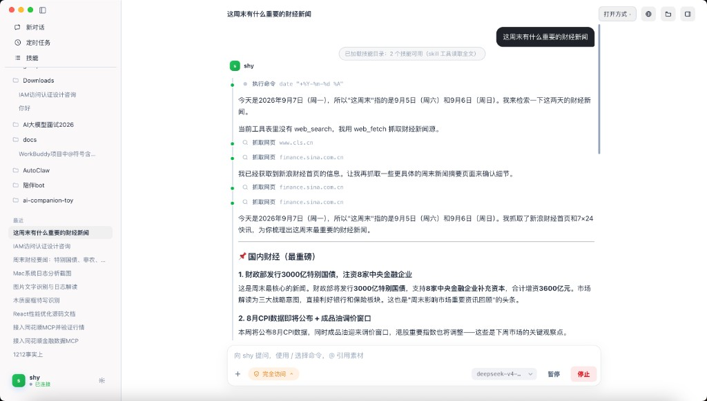

<div align="center">

# shy

**跑在你自己电脑上的个人 Agent 客户端。**

对话协作、本机工具、项目工作区、技能与定时任务 ——
数据全部落在 `~/.shy`，不经过任何第三方服务端。

[快速开始](#-快速开始) · [功能](#-功能) · [架构](#-架构) · [路线图](#-路线图)

<br/>


<p><sub>新对话 · 工作空间 · 会话级模型 · 完全访问</sub></p>

</div>

---

## 产品一览

| 新对话与工作区 | 文档 / 素材并排协作 | Agent 时间轴 |
| :---: | :---: | :---: |
|  |  |  |
| 项目分组历史、快捷提问、模型切换 | 打开 PDF/代码时上下文可见，技能按需加载 | 工具行 + 流式 Markdown + 完成耗时 |

---

## 为什么是 shy

市面上的 Agent 产品大多把会话、记忆和凭据托管在云端。shy 反其道而行：

- **本地优先** —— 会话 / 记忆 / 技能 / 日志全部本地存储（SQLite + 文件系统），`SHY_HOME` 可重定向
- **模型自由** —— 任何 OpenAI-compatible 端点（Minimax、DeepSeek、本地 vLLM/Ollama…），支持**会话级模型**覆盖
- **项目即工作区** —— 代码项目（文件树 + Monaco）与素材项目（画布），会话可绑定本机目录
- **自主但有闸门** —— 默认可自动执行；删除 / 敏感写 / 高危命令强制确认，「完全访问」可跳过逐条弹窗
- **过程可观测** —— 工具调用时间轴、深度思考穿插、流式 Markdown；L2 日志落盘

## ✨ 功能

### 对话与工作区

- **交互式模式** —— 流式 Markdown 正文 + 工具时间轴（命令 / 抓取 / 搜索合并盒等）
- **目标模式** —— LLM 生成验收清单后自动续跑：分段落盘、崩溃恢复、停滞软暂停、token 预算、完成报告
- **项目绑定** —— 左侧按项目分组会话；composer 可选工作空间（代码 / 素材目录）
- **活动文件上下文** —— 正在看的代码 tab 或素材 lightbox 会随请求注入，无需手动 `@`
- **附件与技能 chip** —— `+` 菜单挂文件 / 图片 / 技能；`/` 命令、`@` 引用素材
- **会话级模型** —— 输入区旁切换本轮模型（如 DeepSeek），不改动全局默认

### 技能与定时任务

- 四级技能根：**project**（`.shy/skills`）> **agent** > **user**（`~/.shy/skills`）> **builtin**
- 目录 + `SKILL.md`，热重载；system prompt 注入目录，LLM 用 `skill` 工具按需读全文
- 侧栏「技能」「定时任务」：cron 调度 Agent 回合，可选执行模型

### 内置可视化浏览器

- `WebContentsView` 内嵌于聊天窗口（独立分区，sandbox + contextIsolation）
- 原生 CDP：点击 / 输入 / 滚动 / 截图 / 上传；元素快照 + `browser-element:{uuid}` ref
- 对 LLM 暴露单一 `browser` 工具；`file:` / `javascript:` 导航走确认闸门

### 记忆与本机工具

- **长期记忆** —— SQLite，用户可管；Agent 写入会通知你
- **短期记忆** —— 上下文超阈值时保关键压缩（4 档策略）
- shell / 文件 / 截图 / GUI / 剪贴板等；相对路径落到会话工作区或绑定项目根

### 子代理与扩展

- `task`（后台）与 `dispatch_subagent`（同步）：explore / worker / verifier
- Turn hooks：`beforeLlmCall` / `afterToolCall` 等六类扩展点

## 🚀 快速开始

```bash
# 前置：Node.js 20+
git clone <repo> && cd my-agent
npm install
npx electron-builder install-app-deps   # better-sqlite3 原生模块
npm run dev
```

启动后打开 **设置 → 常规设置 → 模型接入**，填入任意 OpenAI-compatible 端点：

| 字段 | 示例 |
|------|------|
| Base URL | `https://api.minimaxi.com/v1` |
| API Key | `sk-…` |
| Model | `MiniMax-M3` |

会话内也可临时切换模型（如 `deepseek-v4`）。可选：`npx playwright install chromium` 启用 headless `browser_fetch`。

## 🗂 数据目录

一切本机数据统一在 `~/.shy`（`SHY_HOME` 可覆盖）：

```
~/.shy/
├── config/settings.json      # 模型与运行参数
├── db/shy.sqlite             # 会话 / 记忆 / 项目 / 任务
├── skills/                   # 用户级技能（SKILL.md）
├── skills-builtin/           # 内置种子技能
├── sessions/{id}/workspace/  # 未绑定项目时的会话工作区
├── logs/agent/*.jsonl        # L2 运行日志
└── artifacts/                # 报告 / 截图（shy-asset:// 可展示）
```

首次启动若检测到旧 Electron `userData`（原 my-agent）数据，会自动迁移到 `~/.shy`。

## 🏗 架构

Electron 三进程 + 自研编排（无 LangChain 依赖）：

```
src/
├── main/                     # Electron 主进程
│   ├── agent/
│   │   ├── turn-runner/      # 生命周期 + hooks（核心循环）
│   │   ├── graph.ts          # LangGraph 形状适配器
│   │   ├── service.ts        # 会话编排 / catalog / 压缩
│   │   ├── goal-driver.ts    # 目标模式
│   │   ├── subagent/         # 子代理
│   │   ├── tools/            # shell / fs / memory / skill / browser / task…
│   │   └── compaction/       # 上下文压缩
│   ├── browser/              # 内嵌浏览器（CDP / 快照）
│   ├── skills/               # 多根注册表
│   ├── memory/               # 长期记忆 + 短期压缩
│   ├── sessions/             # SQLite 会话
│   ├── schedule/             # cron 定时任务
│   └── event-bridge/         # EventBus → IPC → 渲染层
├── preload/                  # window.shy
└── renderer/                 # React 界面
    └── src/components/       # 对话 / 时间轴 / 项目壳 / 技能 / 设置 / 浏览器
```

事件流：主进程 `EventBus` → IPC → 渲染层（`assistant_delta`、`tool_call/result`、`goal_complete`、`skills_changed`…）。

产品决策见 [`docs/product-brief.md`](docs/product-brief.md)；变更流程见 `AGENTS.md`（OpenSpec + superpowers-bridge）。

## 🧪 测试与脚本

```bash
npm test          # vitest
npm run typecheck # tsc node + web
npm run lint      # eslint
npm run build     # electron-vite 构建
npm run build:win # Windows 安装包
npm run build:mac # macOS 安装包（需在 macOS 执行）
```

## 🔧 扩展点

- **新工具**：`registerTool`（`src/main/agent/tools/registry.ts`）
- **Turn hook**：`RunTurnDeps.hooks`（`src/main/agent/turn-runner/types.ts`）
- **技能根**：`buildDefaultSkillRoots`（`src/main/skills/registry.ts`）
- **功能开发**：OpenSpec change（`openspec/changes/`，schema=`superpowers-bridge`）

## 🗺 路线图

- [x] 项目 / 工作区与代码·素材双布局
- [x] 会话级模型覆盖
- [x] 流式 Markdown 与时间轴对齐
- [x] Composer 附件 / 技能 chip / 多模态透传
- [ ] MCP 协议支持（进行中）
- [ ] 浏览器多 tab 管理界面
- [ ] 插件化技能市场

## 📄 许可证

MIT
